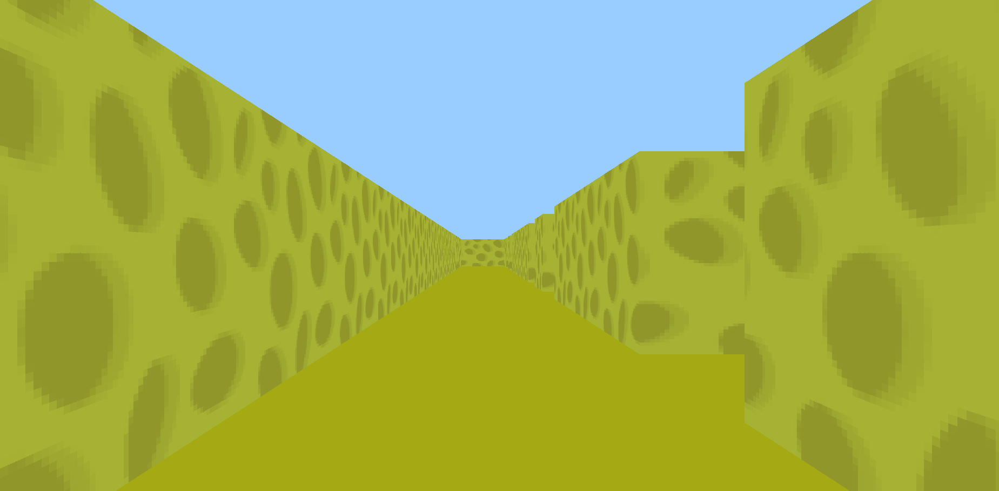

# cub3D

*Built as part of the 42 curriculum in collaboration with [ddias-fe](https://github.com/ddias-fe).*

---

<div align="center">
    
</div>

---

## Overview

cub3D is a 3D maze renderer written in C, inspired by Wolfenstein 3D — one of the first first-person shooters ever made.

The engine uses **raycasting** to simulate a 3D perspective from a 2D map. There is no 3D engine involved — depth, perspective, and scene rendering are computed entirely through mathematics, casting rays from the player's viewpoint and calculating wall distances for each vertical screen slice.

---

## Prerequisites

```bash
sudo apt install libbsd-dev
```

---

## Building

```bash
git clone https://github.com/pmachado364/cub3D.git
cd cub3D
make
```

---

## Running

```bash
./cub3D maps/good/cheese_maze.cub
```

Pass any valid `.cub` map file as the argument.

---

## Controls

| Key | Action |
|-----|--------|
| `W` `A` `S` `D` | Move |
| `←` `→` | Rotate camera |
| `ESC` | Exit |

---

## Makefile

```bash
make        # build
make clean  # remove object files
make fclean # remove objects and binary
make re     # rebuild from scratch
```